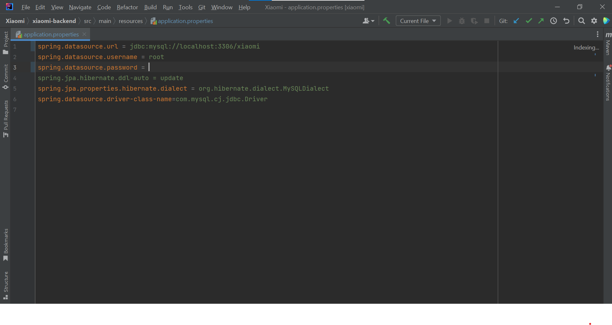
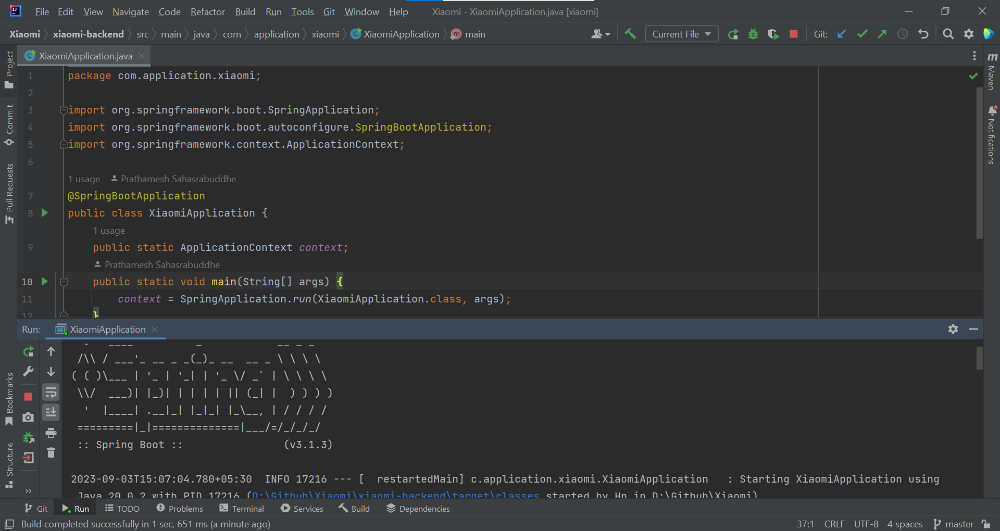
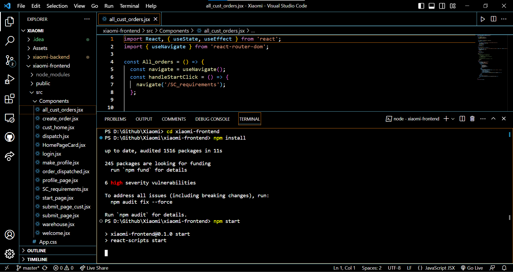
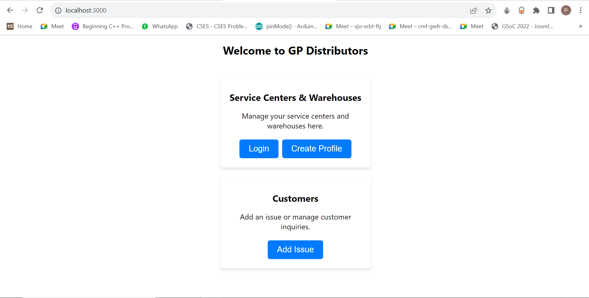

  

# What is GP Distributors?

<ul>
  <li>A small supply chain management software that helps you to simplify and streamline processes such as managing service centers, distributors and warehouses.</li>
  <li>The software uses Java Spring Boot for backend making it highly scalable and robust.</li>
  <li>The frontend is created using React.</li>
  <li>The software can be tailored to suit any type of business and  cater multiple needs by minimal changes.</li>
</ul>

 

# Set Up

  The software is relatively very easy to set up.

  As this application uses Spring Boot and React, you will need to download JAVA (JDK version 20), Maven and react.

  You will also need MySQL for database

  As for the IDE, that is up to you. I usually use IntelliJ for Java and VSCode for React

<h2>Links for Prerequisites</h2>

 
    JDK: https://www.oracle.com/java/technologies/downloads/
     
    Maven: https://maven.apache.org/download.cgi
     
    Node: https://nodejs.org/en/download
     
    IntelliJ IDE: https://www.jetbrains.com/idea/download/
     
    VS Code: https://code.visualstudio.com/download
     
    MySQL: https://www.mysql.com/downloads/

Once you complete the above requirements, follow the given steps to start the set up. Alternatively, you can see the video in <a href="/Assets">Assets</a> folder(If you are unable to view the video please download it on your system).
<ul>
  <li> Open the the project in an IDE. Open the <a href="xiaomi-backend/pom.xml">pom.xml</a> file. All the Spring Boot dependencies are present in this file. Once these dependencies are downloaded, you can close this file. <b>NOTE</b>: If you are using an IDE other than IntelliJ then please check the extensions needed for Spring Boot Application
  </li>
  <li>
  Open MySQL and create a new database "Xiaomi" using the following command
  

    
    CREATE DATABASE xiaomi
  

</li>

<li>
  From the <b>xiaomi-backend</b> folder, open the <a href="xiaomi-backend/src/main/resources/application.properties">application.properties</a> file and set the <b>spring.datasource.password</b> as the password of your MySQL server.
  

</li>
<li>
  From the <b>xiaomi-backend</b> folder, open the <a href="xiaomi-backend/src/main/java/com/application/xiaomi/XiaomiApplication.java">XiaomiApplication.java</a> file and run it. <b>Note</b>: Make sure that the dependencies given in the first step are satisfied.
  

</li>
<li>
  Once you complete the above step, your database will have all the required tables. Now open the <a href="Assets/trigger_setup.sql">trigger_setup.sql</a> file in MySQL Workbench and run it. Once done, the required tables will be populated with data and sql triggers will be created.
</li>
<li>
  Open the <b>xiaomi</b> folder (i.e. the project folder) in your terminal and start the node project using the following command.
  

    cd xiaomi-frontend
    npm install
    npm start
  

  

</li>
<li>
  After running the above command, a new tab will open on your browser (mostly on localhost:3000). From there onwards, you can refer the <a href="Assets/Xiaomi-Final-Video.mkv">video</a> from 2:11 to see how the project works.
  

</li>
</ul>

